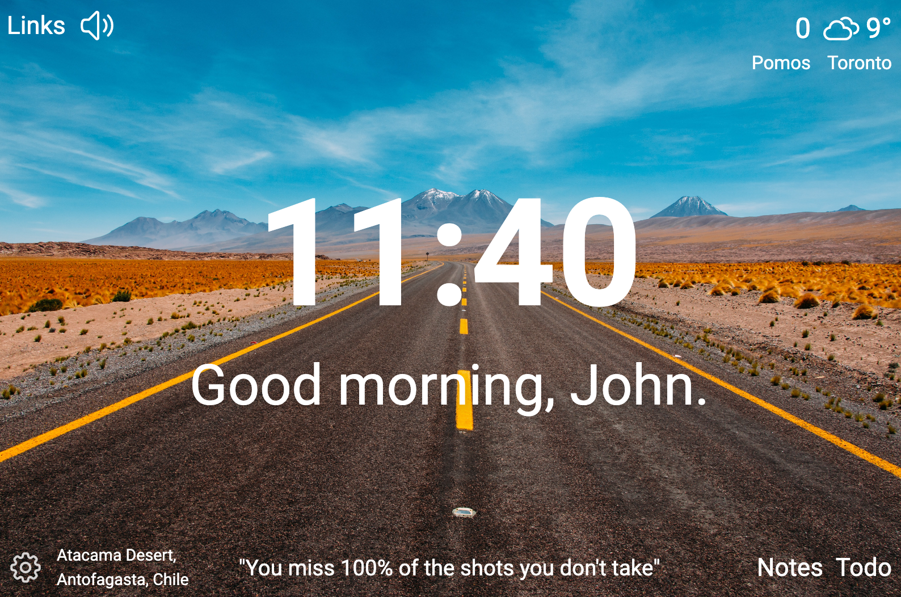
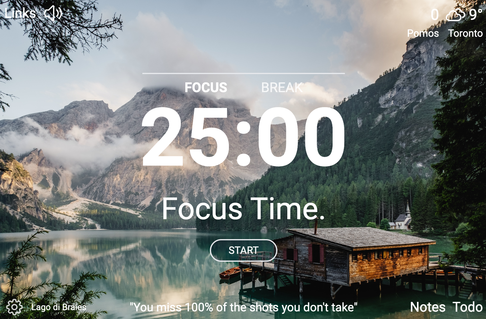

# Morning Coffee (Momentum Clone)
I am a big huge of the [Momentum App](https://momentumdash.com/). Unfortunately, several of the features (including the pomodoro timer) were behind a paid subscription. This was the perfect opportunity to build my own app from scratch.

### How Its Made
Tech used: React, Express, MongoDB, Tailwind CSS, Unsplash API, Google's Geolocation API, and OpenWeather API

### Packages/Dependencies Used
**frontend**: @emotion, @headlessui, @heroicons, @mui, @popperjs, axios, react, react-live-clock, react-popper, react-live-clock
**backend**: axios, bcrypt, concurrently, cors, dotenv, express, jsonwebtoken, mongoose, morgan, nodemon, unsplash-js

### Screenshots

### Links

- GitHub: [github.com/johnmal-dev/morning_coffee](https://github.com/johnmal-dev/morning_coffee)
- Live Site: coming soon!

### Features Implemented
- [x] live clock
- [x] get weather data from API
- [x] users can change background image (randomly)
- [x] to-do list functionality
- [x] login functionality
- [x] pomodoro timer

### Next Steps
- [ ] revise authentication method
- [ ] save favourites, changes to DB
- [ ] manually change location for weather API
- [ ] weather modal with more detailed weather information
- [ ] ability to save links
- [ ] widget plus-minus functionality
- [ ] add more quotes to db
- [ ] mantra option
- [ ] notes functionality

## Other Projects:

Take a look at a few more projects that I have in my own portfolio:

**Listify App:** https://github.com/johnmal-dev/listify

**Binary Upload Boom App:** https://github.com/johnmal-dev/binary-upload-boom

**Chingu Change App:** https://github.com/johnmal-dev/chingu-change

**Chingu Chat App:** https://github.com/johnmal-dev/chingu-chat